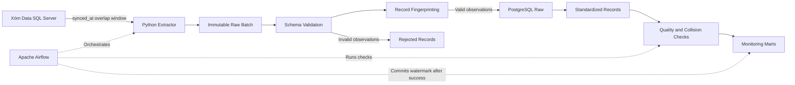

# Shopee Marketplace Data Quality Pipeline Architecture

## System context

The pipeline extracts marketplace observations from the read-only Xóm Data SQL
Server source. It preserves immutable batches, validates and fingerprints the
records, loads them into PostgreSQL, and publishes aggregate source-health
metrics. Because masking creates identifier collisions, the system does not
claim order-level or customer-level analytics.

The processing scope is append-only: every received source observation remains
in the raw layer with its batch lineage. Exact content seen through the
incremental overlap window is deduplicated only in staging; raw history is
never updated or deleted to manufacture a business entity view.

## Data flow

## Data layers

| Layer          | Grain                                        | Purpose                                                   |
| -------------- | -------------------------------------------- | --------------------------------------------------------- |
| Raw files      | One extracted batch                          | Preserve the source response for replay                   |
| PostgreSQL raw | One observed source record per batch         | Store immutable observations and ingestion metadata       |
| Staging        | One distinct record fingerprint              | Standardize types and remove exact re-ingestion           |
| Monitoring     | One test result or pipeline event            | Record quality, reconciliation, freshness, and collisions |
| Marts          | One metric per date and monitoring dimension | Support aggregate operational source-health reporting     |

## Reliability requirements

- Reprocessing the same batch must not create duplicate records.
- Invalid records must be isolated instead of silently discarded.
- Every run must record its batch identifier and ingestion timestamp.
- Source and destination row counts must be reconcilable.
- Logs must not expose names, phone numbers, addresses, or credentials.

## Current constraints

- The latest profiled source snapshot contains 25,546 records.
- Profiling measurements are snapshot-specific because the source changes.
- The dataset may not receive continuous updates.
- Historical dates will be replayed as batches to demonstrate backfills.
- The project is designed for learning and portfolio evaluation, not production use.

## System invariants

- Masked source identifiers are never treated as unique keys.
- Raw observations are immutable.
- Append-only raw storage preserves repeated observations and batch lineage.
- Reprocessing a batch does not duplicate standardized records.
- Every loaded or rejected record belongs to a known batch.
- Extracted row count equals loaded, duplicate, and rejected row counts.
- The watermark advances only after successful reconciliation.
- Record fingerprints identify content, not business entities.
- No unique-order or unique-customer metric is published.
