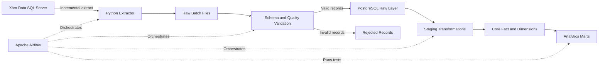

# Shopee Order Analytics Pipeline Architecture

## System context

The pipeline extracts Shopee order records from the read-only Xóm Data SQL
Server source. It preserves a raw copy, validates the records, loads them
idempotently into PostgreSQL, and produces analytics-ready data marts.

## Data flow

## Data layers

| Layer          | Purpose                                                                 |
| -------------- | ----------------------------------------------------------------------- |
| Raw files      | Preserve source batches for replay and debugging                        |
| PostgreSQL raw | Store source-shaped records with ingestion metadata                     |
| Staging        | Normalize types, statuses, timestamps, and sensitive fields             |
| Core           | Represent reusable business entities and order-item facts               |
| Marts          | Provide aggregated data for sales, fees, cancellations, and fulfillment |

## Reliability requirements

- Reprocessing the same batch must not create duplicate records.
- Invalid records must be isolated instead of silently discarded.
- Every run must record its batch identifier and ingestion timestamp.
- Source and destination row counts must be reconcilable.
- Logs must not expose names, phone numbers, addresses, or credentials.

## Current constraints

- The source contains a sample of 5,000 Shopee records.
- The dataset may not receive continuous updates.
- Historical dates will be replayed as batches to demonstrate backfills.
- The project is designed for learning and portfolio evaluation, not production use.
